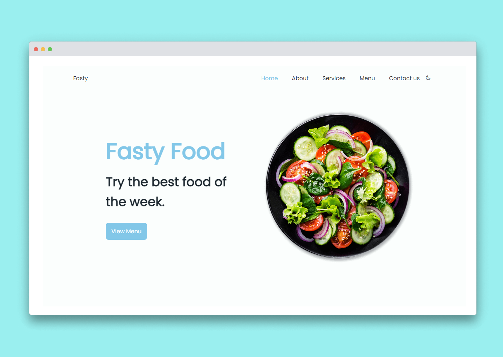

<h1 align="center"> Fasty Food ☀️ </h1>

[Fasty food](), es una onepage de un restaurante de ensaladas. Cuenta con varias secciones como home, about, services, menu y contact. También cuenta con el cambio de tema [light-dark]. Es moderna y con animaciones.

**Sólo disfruta de la genialidad** 😉

Checa la demo aquí: <a href="fasty-food.vercel.app" target="_blank">https://fasty-food.vercel.app/</a>

<hr>

<div align="center">

 </img>

</div>

## Table of Contents

- [Technology Stack](#technology-stack)
- [Installation & Usage](#installation-&-usage)

## Technology Stack

| Technology          | Description                                         | Link ↘️                            |
| --------------------| -----------------------------------------           | ----------------------------------- |
| HTML5               | Lenguaje de Marcado de Hipertexto                   | ----                                |
| CSS3                | Hoja de cascadas de estilos                         | ----                                |
| JavaScript          | Lenguaje de alto nivel, dinámico e interpretado     | ----                                |
| ScrollReveal        | Biblioteca de JavaScript para animar elementos      | https://scrollrevealjs.org/         |
| Webpack             | Paquete de módulos de JavaScript de código abierto  | https://webpack.js.org/             |


## Installation & Usage


_Asegúrese de que [Node.js](https://nodejs.org/en/) y [NPM](https://www.npmjs.com/) estén instalados_


1. Clona o descarga el repositorio (dependiendo de si estás usando SSH o HTTPS)

```
git clone https://github.com/piercenovo/fasty-food.git
cd fasty-food
```

2. Install dependencies

```
npm i
```

3. Start the application

```
npm start
```

Después de que la aplicación inicie, visite [http://localhost:9090](http://localhost:9090) para verlo en el navegador.

3. Build the application

```
npm run build
```
Se creará una carpeta `dist` donde se encontrarán los archivos comprimidos necesarios para que la onepage se ejecute.

<br />

Thanks.. 🚀✨
